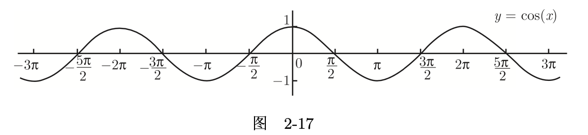
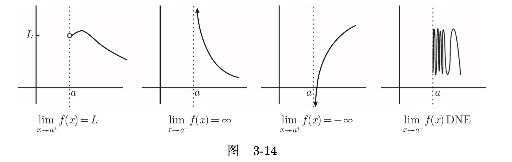

# 普林斯顿微积分读本

---

## 1. 函数，图像和直线

### 1.1 函数

- 函数是将一个对象转化为另一个对象的规则. 起始对象称为输入, 来自称为定义域的集合. 返回对象称为输出, 来自称为上域的集合.
- 一个函数必须给每一个有效的输入指定唯一的输出
- 为什么值域和上域不是一回事呢？值域实际上是上域的一个子集. 上域是可能输出的集合, 而值域则是实际输出的集合

#### 1.1.1 区间表示法

- 闭区间: $[a,b]$, 表示从a到$b$的闭区间, 包括$a$和$b$
- 开区间: $(a,b)$, 表示从$a$到$b$的开区间, 不包括$a$和$b$
- 半开半闭区间: $[a,b)$, 表示从$a$到$b$的半开半闭区间, 包括$a$, 不包括$b$
- 半开半闭区间: $(a,b]$, 表示从$a$到$b$的半开半闭区间, 不包括$a$, 包括$b$
- 无限区间: $(-\infty, a)$, 表示从负无穷到$a$的区间, 不包括$a$
- 无限区间: $(a, +\infty)$, 表示从$a$到正无穷的区间, 不包括$a$

#### 1.1.2 求定义域

#### 1.1.3 利用图像求值域

#### 1.1.4 垂线检验

函数的核心概念是一个$x$只能有唯一$y$对应,如果有2个,则不是函数.但是需要注意,多个$x$可以对应同一个$y$,但是这种函数往往不存在反函数
垂线检验:就是说,如果一条垂直于x轴的直线与函数的图像相交于多于一点,那么这个函数就不是函数.

### 1.2 反函数

1. 从一个函数$f$出发, 使得对于在$f$值域中的任意$y$, 都只有唯一的$x$值满足$f(x)=y$. 也就是说, 不同的输入对应不同的输出. 现在, 我们就来定义反函数$f^{−1}$
2. $f^{-1}$的定义域和$f$的值域相同.
3. $f^{-1}$的值域和$f$的定义域相同.
4. $f^{-1}(y)$的值就是满足$f(x)=y$的$x$. 所以,如果$f(x)=y$, 那么$f^{−1}(y)=x$.

#### 1.2.1 水平线检验

水平线检验：如果每一条水平线和一个函数的图像相交至多一次, 那么这个函数就有一个反函数.

#### 1.2.2 求反函数

在图像上画一条$y=x$的直线, 然后将这条直线假想为一个双面的镜子.反函数就是原始函数的镜面反射.

#### 1.2.3 限制定义域

#### 1.2.4 反函数的反函数

如果一个函数$f$的定义域可以被限制, 使得$f$有反函数$f^{−1}$, 那么

- 对于$f$值域中的所有$y$, 都有$f(f^{−1}(y))=y$
- 但是$f^{-1}(f(x))$可能不等于$x$; 事实上, $f^{−1}(f(x))=x$仅当$x$在限制的定义域中才成立.

### 1.3 函数的复合

函数的复合和函数相乘相除不是一个概念, 函数的复合是函数的嵌套, 函数相乘相除是函数的乘积和商.
欧美的写法是$f=g\circ h\circ i$咱们的方式是$f=g(h(i(x)))$

### 1.4 奇函数和偶函数

- $f(-x)=-f(x)$奇函数
- $f(-x)=f(x)$偶函数
- 既不是奇函数也不是偶函数
- 既是奇函数也是偶函数$f(x)=0$

奇函数的图像关于原点对称,偶函数的图像关于$y$轴对称
奇函数$\times$奇函数$=$偶函数
偶函数$\times$偶函数$=$偶函数
偶函数$\times$奇函数$=$奇函数
奇函数$\pm$奇函数$=$奇函数
偶函数$\pm$偶函数$=$偶函数

### 1.5 线性函数的图像

- (点斜式)如果已知直线通过点$(x_0, y_0)$, 斜率为m, 则它的方程为$y-y_0=m(x-x_0)$.
- (两点式)如果一条直线通过点$(x_1, y_1)$和$(x_2, y_2)$, 则它的斜率等于$\frac{y_2-y_1}{x_2-x_1}$,它的方程为$\frac{y-y_1}{x-x_1}=\frac{y_2-y_1}{x_2-x_1}$ 

### 1.6 常见函数及其图像

- 多项式函数的图像是曲线, 而不是直线.其主要图像取决于最高次项的系数和次数.

- 有理函数
- 指数函数和对数函数

### 1.7 本章扩展部分

### 1.8 本章小结

---

## 2. 三角学回顾

### 2.1 基本知识

1. angle（角度），chord（弦），radian（弧度）

2. sin(α)（正弦），cos(α)（余弦），tan(α)（正切），cot(α)（余切）

因为是单位圆,所以$c=1$
$$
\tan(\alpha)=\frac{sin(\alpha)}{cos(\alpha)}=\frac{a}{b}
$$
根据相似三角形定理
$$
\begin{cases}
\frac{a}{b}=\frac{d}{c} \\
c=1
\end{cases}
$$
所以
$$
\tan(\alpha)=\frac{sin(\alpha)}{cos(\alpha)}=\frac{a}{b}=d
$$

1. sec(α)（正割），csc(α)（余割），exs(α)（外正割），exc(α)（外余割）

### 2.2 扩展三角函数的定义域

参考角:角$\theta$射线和$x$轴的夹角叫做这个射线的参考角.

#### 2.2.1 ASTC方法

以下是用 ASTC 方法来求介于 0 到 2π 的角的三角函数值的总结.

1. 画出象限图, 确定在该图中你感兴趣的角在哪里, 然后在图中标出该角.
2. 如果你想要的角在$x$轴或$y$轴上 (即没有在任何象限中), 那么就画出三角函数的图像, 从图像中读取数值 (2.3 节有一些例子).
3. 否则, 找出在代表我们想要的那个角的射线和$x$轴之间最小的角, 这个角被称为参考角.
4. 如果可以, 使用那张重要的表来求出参考角的三角函数值. 那就是你需要的答案, 除了你可能还需要在得到的值前面添一个负号.
5. 使用 ASTC 图来决定你是否需要添一个负号.

#### 2.2.2 $[0, 2\pi]$以外的三角函数

利用三角函数的周期性来求解,三角函数的周期性是指三角函数的值在每$2\pi$个单位内重复出现. 例如, $sin(2\pi + \frac{\pi}{2})=sin(\frac{\pi}{2})=\frac{\sqrt{2}}{2}$, 因为$sin(2\pi+\frac{\pi}{2})$和$sin(\frac{\pi}{2})$的值相同.

### 2.3 三角函数的图像

1. 正弦函数的图像

2. 余弦函数的图像

3. 正切函数的图像

4. 余切函数的图像

5. 正割函数的图像

6. 余割函数的图像

### 2.4 三角恒等式

$$tan(\alpha)=\frac{sin(\alpha)}{cos(\alpha)}$$

$$cot(\alpha)=\frac{cos(\alpha)}{sin(\alpha)}$$

$$sec(\alpha)=\frac{1}{cos(\alpha)}$$

$$csc(\alpha)=\frac{1}{sin(\alpha)}$$

$$sin^2(\alpha)+cos^2(\alpha)=1$$

$$tan^2(\alpha)+1=sec^2(\alpha)$$

$$cot^2(\alpha)+1=csc^2(\alpha)$$

$$三角函数(x)=co三角函数(\frac{\pi}{2}-x)$$

$$sin(A\pm B)=sinAcosB\pm cosAsinB$$

$$cos(A\pm B)=cosAcosB\mp sinAsinB$$

$$tan(A\pm B)=\frac{tanA\pm tanB}{1\mp tanAtanB}$$

$$sin(2\alpha)=2sin\alpha cos\alpha$$

$$cos(2\alpha)=cos^2\alpha-sin^2\alpha=2cos^2\alpha-1=1-2sin^2\alpha$$

$$tan(2\alpha)=\frac{2tan\alpha}{1-tan^2\alpha}$$

$$2sin(\alpha)cos(\beta)=sin(\alpha+\beta)+sin(\alpha-\beta)$$

$$2cos(\alpha)sin(\beta)=sin(\alpha+\beta)-sin(\alpha-\beta)$$

$$2cos(\alpha)cos(\beta)=cos(\alpha+\beta)+cos(\alpha-\beta)$$

$$2sin(\alpha)sin(\beta)=cos(\alpha-\beta)-cos(\alpha+\beta)$$

$$sin(\alpha)+sin(\beta)=2sin(\frac{\alpha+\beta}{2})cos(\frac{\alpha-\beta}{2})$$

$$sin(\alpha)-sin(\beta)=2cos(\frac{\alpha+\beta}{2})sin(\frac{\alpha-\beta}{2})$$

$$cos(\alpha)+cos(\beta)=2cos(\frac{\alpha+\beta}{2})cos(\frac{\alpha-\beta}{2})$$

$$cos(\alpha)-cos(\beta)=-2sin(\frac{\alpha+\beta}{2})sin(\frac{\alpha-\beta}{2})$$

### 2.5 本章扩展部分

### 2.6 本章小结

---

## 3. 极限导论

### 3.1 极限:基本思想

极限是否存在以及值是多少和函数在该点的值无关

### 3.2 左极限与右极限

左极限:$\lim_{x\to 3^{-}}h(x)=1$
右极限:$\lim_{x\to 3^{+}}h(x)=-2$

极限存在的充要是左右极限都存在且相等

### 3.3 何时不存在极限

1. 左右极限有一个不存在,$\pm\infty$属于极限不存在的情况
2. 左右极限不相等

### 3.4 在$\infty$和$-\infty$处的极限

垂直渐近线:

- $f$在$x=a$处有一条垂直渐近线说的是$\lim_{x\to a^{+}}f(x)$和$\lim_{x\to a^{-}}f(x)$,其中至少有一个极限是$\infty$或$-\infty$

水平渐近线:

- $f$在$y=L$处有一条右侧水平渐近线:$\lim_{x\to \infty}f(x)=L$
- $f$在$y=M$处有一条左侧水平渐近线:$\lim_{x\to -\infty}f(x)=M$

$sin(\frac{1}{x})$的图像

### 3.5 关于渐近线的两个常见误解

1. 一个函数最多有2条不同的水平渐近线,也可能没有水平渐近线,或只有一条水平渐近线.
2. 一个函数可能有多条垂直渐近线,也可能没有垂直渐近线,或只有一条垂直渐近线.
3. 函数是可以和它的渐近线相交的.

### 3.6 三明治定理

夹逼定理:

$$
\begin {cases}
g(x)\leq f(x)\leq h(x) \\
\lim_{x\to a}g(x)=\lim_{x\to a}h(x)=L
\end {cases}
$$

$$=> \lim_{x\to a}f(x)=L$$

举例: $$\lim_{x\to 0^{+}}x\sin(\frac{1}{x})$$

$$
-1\leq \sin(\frac{1}{x})\leq 1 \\
-x\leq x\sin(\frac{1}{x})\leq x
$$

### 3.7 极限的基本类型小结

右极限

左极限

双侧极限

在$x\to \infty$时的极限

在$x\to -\infty$时的极限

### 3.8 本章扩展部分

### 3.9 本章小节

---

## 4. 求解多项式的极限问题

### 4.1 $x\to a$时的有理函数的极限

### 4.2 $x\to a$时平方根的极限

### 4.3 $x\to \infty$时有理函数的极限

### 4.4 $x\to \infty$时多项式函数的极限

### 4.5 $x\to -\infty$时有理函数的极限

### 4.6 包含绝对值的函数极限

### 4.7 本章扩展部分

### 4.8 本章小结

---

## 5. 连续性和可导性

### 5.1 连续性

#### 5.1.1 在一点处连续

#### 5.1.2 在一个区间上连续

#### 5.1.3 连续函数的一些例子

#### 5.1.4 介值定理

#### 5.1.5 一个更难的介值定理

#### 5.1.6 连续函数的最大值和最小值

### 5.2 可导性

#### 5.2.1 平均速率

#### 5.2.2 位移和速度

#### 5.2.3 瞬时速度

#### 5.2.4 速度的图像阐释

#### 5.2.5 切线

#### 5.2.6 导函数

#### 5.2.7 作为极限比的导数

#### 5.2.8 线性函数的导数

#### 5.2.9 二阶导数和更高阶导数

#### 5.2.10 何时导数不存在

#### 5.2.11 可导性和连续性

### 5.3 本章扩展部分

### 5.4 本章小结

---

## 6. 求解微分方程

### 6.1 使用定义求导

### 6.2 用更好的办法求导

#### 6.2.1 函数的常数倍

#### 6.2.2 函数与函数差

#### 6.2.3 通过乘积法则求积函数的导数

#### 6.2.4 通过商法则求商函数的导数

#### 6.2.5 通过链式求导法则求复合函数的导数

#### 6.2.6 那个难以处理的例子

#### 6.2.7 乘积法则和链式求导法则的理由

### 6.3 求切线方程

### 6.4 速度和加速度

### 6.5 导数伪装的极限

### 6.6 分段函数的导数

### 6.7 直接画出导函数的理由

### 6.8 本章扩展部分

### 6.9 本章小结

---

## 7. 三角函数的极限和导数

### 7.1 三角函数的极限

#### 7.1.1 小数的情况

#### 7.1.2 问题的求解-小数的情况

#### 7.1.3 大数的情况

#### 7.1.4 “其他的”情况

#### 7.1.5 一个重要极限的证明

## 7.2 三角函数的导数

### 7.2.1 求三角函数导数的例子

### 7.2.2 简谐运动

简谐运动是一种理想化的往复运动，物体所受的力跟位移成正比且方向相反。其运动方程可以表示为 x = A sin (ωt + φ) 或 x = A cos (ωt + φ) ，其中 A 是振幅，ω 是角频率，φ 是初相位，t 是时间，x 是位移。
在简谐运动中，位移、速度和加速度都可以用三角函数来描述，而对这些三角函数进行求导就可以得到速度和加速度的表达式。比如位移 x = A sin (ωt + φ) ，对其求导得到速度 v = ωA cos (ωt + φ) ，再求导得到加速度 a = -ω²A sin (ωt + φ) 。
研究简谐运动具有重要意义。在物理学中，它是理解振动现象的基础，许多自然现象和工程问题都涉及简谐运动，比如机械振动、电磁振荡等。在工程技术领域，对于设计和优化振动系统，如减震装置、钟表机构等有重要指导作用。在通信领域，电磁波的传播也与简谐运动相关。在生物学中，某些生物的生理活动也呈现出简谐运动的特征。总之，对简谐运动的研究有助于我们更好地理解和解释自然界和工程中的各种周期性运动现象。

### 7.2.3 一个有趣的函数

## 7.3 本章扩展部分

## 7.4 本章小结

---

## 8 隐函数求导和相关变化率

### 8.1 隐函数求导

#### 8.1.1 技巧和例子

#### 8.1.2 隐函数求二阶导

### 8.2 相关变化率

#### 8.2.1 一个简单的例子

#### 8.2.2 一个稍难的例子

#### 8.2.3 一个更难的例子

#### 8.2.4 一个非常难的例子

## 8.3 本章扩展部分

## 8.4 本章小结

---

## 9 指数函数和对数函数

### 9.1 基础知识

#### 9.1.1 指数函数的回顾

#### 9.1.2 对数函数的回顾

#### 9.1.3 对数函数、指数函数及反函数

#### 9.1.4 对数法则

### 9.2 $e$的定义

#### 9.2.1 一个有关复利的问题

#### 9.2.2 问题的答案

#### 9.2.3 更多关于$e$和对数函数的内容

### 9.3 对数函数和指数函数求导

### 9.4 求解指数函数或对数函数的极限

#### 9.4.1 涉及e的定义的极限

#### 9.4.2 指数函数在$0$附近的行为

#### 9.4.3 对数函数在$1$附近的行为

#### 9.4.4 指数函数在$\infty$或$-\infty$附近的行为

#### 9.4.5 对数函数在$\infty$附近的行为

#### 9.4.6 对数函数在$0$附近的行为

### 9.5 取对数求导法

### 9.6 指数增加和指数衰变

#### 9.6.1 指数增长

#### 9.6.2 指数衰变

### 9.7 双曲函数

### 9.8 本章扩展部分

### 9.9 本章小结

---

## 10. 反函数和反三角函数

### 10.1 导数和反函数

#### 10.1.1 使用导数证明反函数存在

#### 10.1.2 导数和反函数:可能出现的问题

#### 10.1.3 求反函数的导数

#### 10.1.4 一个综合性的例子

### 10.2 反三角函数

#### 10.2.1 反正弦函数

#### 10.2.2 反余弦函数

#### 10.2.3 反正切函数

#### 10.2.4 反正割函数

### 10.3 反双曲函数

### 10.4 本章扩展部分

### 10.5 本章小结

---

## 11 导数和图像

### 11.1 函数的极值

#### 11.1.1 全局极值和局部极值

#### 11.1.2 极值定理

#### 11.1.3 求全局最大值和最小值

### 11.2 罗尔定理

### 11.3 中值定理

### 11.4 二阶导数和图像

### 11.5 对导数为0点的分类

#### 11.5.1 使用一次导数

#### 11.5.2 使用二次导数

### 11.6 本章扩展部分

### 11.7 本章小结

---

## 12 绘制函数的图像

### 12.1 建立符号表格

### 12.1.1 建立一阶导数的符号表格

### 12.1.2 建立二阶导数的符号表格

### 12.2 绘制函数图像的全面方法

### 12.3 例题

#### 12.3.1 一个不使用导数的例子

#### 12.3.2 完整的方法：例一

#### 12.3.3 完整的方法：例二

#### 12.3.4 完整的方法：例三

#### 12.3.5 完整的方法：例四

### 12.4 本章扩展部分

### 12.5 本章小结

---

## 13 最优化和线性化

### 13.1 最优化

#### 13.1.1 一个简单的最优化例子

#### 13.1.2 最优化问题：一般方法

#### 13.1.3 一个最优化的例子

#### 13.1.4 另一个最优化例子

#### 13.1.5 在最优化问题中使用隐函数求导

#### 13.1.6 一个较难的最优化例子

### 13.2 线性化

#### 13.2.1 线性化问题：一般方法

#### 13.2.2 微分

#### 13.2.3 线性化的总结和例子

#### 13.2.4 近似中的误差

### 13.3 牛顿法

### 13.4 本章扩展部分

### 13.5 本章小结

---

## 14 洛必达法则及极限问题的总结

### 14.1 洛必达法则

#### 14.1.1 类型A:$\frac{0}{0}$

#### 14.1.2 类型A:$\frac{\pm\infty}{\pm\infty}$

#### 14.1.3 类型B1:$(-\infty,\infty)$

#### 14.1.4 类型B2$(0\times\pm\infty)$

#### 14.1.5 类型C:$(1^{\pm\infty}, 0^0, \infty^0)$

#### 14.1.6 洛必达法则类型总结

### 14.2 关于极限的总结

### 14.3 本章扩展部分

### 14.4 本章小结

---

## 15 积分

### 15.1 求和符号

#### 15.1.1 一个有用的求和

#### 15.1.2 伸缩求和法

### 15.2 位移和面积

#### 15.2.1 三个简单的例子

#### 15.2.2 一段更常规的旅行

#### 15.2.3 有向面积

#### 15.2.4 连续的速度

#### 15.2.5 两个特别的估算

### 15.3 本章扩展部分

### 15.4 本章小结

---

## 16 定积分

### 16.1 基本思想

### 16.2 定积分的定义

### 16.3 定积分的性质

### 16.4 求面积

#### 16.4.1 求通常的面积

#### 16.4.2 求解两条曲线之间的面积

#### 16.4.3 求曲线与$y$轴所围成的面积

### 16.5 估算积分

### 16.6 积分的平均值和中值定理

### 16.7 不可积的函数

### 16.8 本章扩展部分

### 16.9 本章小结

---

## 17 微积分的基本定理

### 17.1 用其他函数的积分来表示的函数

### 17.2 微积分的第一基本定理

### 17.3 微积分的第二基本定理

### 17.4 不定积分

### 17.5 怎样解决问题：微积分的第一基本定理

#### 17.5.1 变形1：变量是积分下限

#### 17.5.2 变形2：积分上限是个函数

#### 17.5.3 变形3：积分上下限都是函数

#### 17.5.4 变形4：导数伪装成极限

### 17.6 怎样解决问题：微积分的第二基本定理

#### 17.6.1 计算不定积分

#### 17.6.2 计算定积分

#### 17.6.3 面积和绝对值

### 17.7 技术要点

### 17.8 微积分第一基本定理的证明

---

## 18 积分的方法 I

### 18.1 换元法

#### 18.1.1 换元法和定积分

#### 18.1.2 如何换元

#### 18.1.3 换元法的理论解释

### 18.2 分部积分法

### 18.3 部分分式

#### 18.3.1 部分分式的代数运算

#### 18.3.2 对每一部分积分

#### 18.3.3 方法和一个完整的例子

### 18.4 本章扩展部分

### 18.5 本章小结

---

## 19 积分的方法 II

### 19.1 应用三角恒等式的积分

### 19.2 关于三角函数的幂的积分

#### 19.2.1 $sin$或$cos$的幂

#### 19.2.2 $tan$的幂

#### 19.2.3 $sec$的幂

#### 19.2.4 $cot$的幂

#### 19.2.5 $csc$的幂

#### 19.2.6 约化公式

### 19.3 关于三角换元法的积分

#### 19.3.1 类型1:$\sqrt{a^2-x^2}$

#### 19.3.2 类型2:$\sqrt{a^2+x^2}$

#### 19.3.3 类型3:$\sqrt{x^2-a^2}$

#### 19.3.4 配方和三角换元法

#### 19.3.5 关于三角换元法的总结

#### 19.3.6 平方根的方法和三角换元法

### 19.4 积分技巧总结

### 19.5 本章扩展部分

### 19.6 本章小结

---

## 20 反常积分:基本概念

### 20.1 收敛和发散

#### 20.1.1 反常积分的一些例子

#### 20.1.2 其他破裂点

### 20.2 关于无穷区间上的积分

### 20.3 比较判别法（理论）

### 20.4 极限比较判别法（理论）

#### 20.4.1 函数互为渐近线

#### 20.4.2 关于判别法的陈述

### 20.5 $p$判别法（理论）

### 20.6 绝对收敛判别法

### 20.7 本章扩展部分

### 20.8 本章小结

---

## 21 反常积分:如何解题

### 21.1 如何开始

#### 21.1.1 拆分积分

#### 21.1.2 如何处理负函数值

### 21.2 积分判别法总结

### 21.3 常见函数在$\infty$和$-\infty$附近的表现

#### 21.3.1 多项式和多项式型函数在$\infty$和$-\infty$附近的表现

#### 21.3.2 三角函数在$\infty$和$-\infty$附近的表现

#### 21.3.3 指数在$\infty$和$-\infty$附近的表现

#### 21.3.4 对数在$\infty$附近的表现

### 21.4 常见函数在$0$附近的表现

#### 21.4.1 多项式和多项式型函数在$0$附近的表现

#### 21.4.2 三角函数在$0$附近的表现

#### 21.4.3 指数在$0$附近的表现

#### 21.4.4 对数在$0$附近的表现

#### 21.4.5 更一般的函数在$0$附近的表现

### 21.5 如何应对不在$0$或$\infty$处的瑕点

### 21.6 本章扩展部分

### 21.7 本章小结

---

## 22 数列和级数:基本概念

### 22.1 数列的收敛和发散

#### 22.1.1 数列和函数的联系

#### 22.1.2 两个重要的数列

### 22.2 级数的收敛和发散

### 22.3 第n项判别法

### 22.4 无穷级数和反常积分的性质

#### 22.4.1 比较判别法

#### 22.4.2 极限比较判别法

#### 22.4.3 p-判别法

#### 22.4.4 绝对收敛判别法

### 22.5 级数的新判别法

#### 22.5.1 比较判别法

#### 22.5.2 根式判别法

#### 22.5.3 积分判别法

#### 22.5.4 交错级数判别法

### 22.6 本章扩展部分

### 22.7 本章小结

---

## 23 求解级数问题

### 23.1 求几何级数的值

### 23.2 应用第n项判别法

### 23.3 应用比式判别法

### 23.4 应用根式判别法

### 23.5 应用积分判别法

### 23.6 应用比较判别法,极限比较判别法和p-判别法

### 23.7 应对含有负项的级数

### 23.8 本章扩展部分

### 23.9 本章小结

---

## 24 泰勒多项式、泰勒级数和幂级数导论

### 24.1 近似值和泰勒多项式

#### 24.1.1 重访线性化

#### 24.1.2 二次近似

#### 24.1.3 高阶近似

#### 24.1.4 泰勒定理

### 24.2 幂级数和泰勒级数

#### 24.2.1 一般幂级数

#### 24.2.2 泰勒级数和麦克劳林级数

#### 24.2.3 泰勒级数的收敛性

### 24.3 一个有用的极限

### 24.4 本章扩展部分

### 24.5 本章小结

---

## 25 求解估算问题

### 25.1 泰勒多项式与泰勒级数总结

### 25.2 求泰勒多项式与泰勒级数

### 25.3 用误差项估算问题

#### 25.3.1 第一个例子

#### 25.3.2 第二个例子

#### 25.3.3 第三个例子

#### 25.3.4 第四个例子

#### 25.3.5 第五个例子

#### 25.3.6 误差项估算的一般方法

### 25.4 误差估算的另一种方法

### 25.5 本章扩展部分

### 25.6 本章小结

---

## 26 泰勒级数和幂级数:如何解题

### 26.1 幂级数的收敛性

#### 26.1.1 幂级数的收敛半径

#### 26.1.2 求收敛半径和收敛区间

### 26.2 合成新的泰勒级数

#### 26.2.1 代换和泰勒级数

#### 26.2.2 泰勒级数求导

#### 26.2.3 泰勒级数求积分

#### 26.2.4 泰勒级数相加和相减

#### 26.2.5 泰勒级数相乘

#### 26.2.6 泰勒级数相除

### 26.3 利用幂级数和泰勒级数求导

### 26.4 利用麦克劳林级数求极限

### 26.5 本章扩展部分

### 26.6 本章小结

---

## 27 参数方程和极坐标

### 27.1 参数方程

### 27.2 极坐标

#### 27.2.1 极坐标和笛卡尔坐标互换

#### 27.2.2 极坐标中画曲线

#### 27.2.3 求极坐标曲线的切线

#### 27.2.4 求极坐标曲线围成的面积

### 27.3 本章扩展部分

### 27.4 本章小结

---

## 28 复数

### 28.1 基础

### 28.2 复平面

### 28.3 复数的高次幂

### 28.4 解$z^n=\omega$

### 28.5 解$e^n=\omega$

### 28.6 一些三角级数

### 28.7 欧拉恒等式和幂级数

### 28.8 本章扩展部分

### 28.9 本章小结

---

## 29 体积,弧长和表面积

### 29.1 旋转体的体积

#### 29.1.1 圆盘法

#### 29.1.2 壳法

#### 29.1.3 总结和变式

#### 29.1.4 变式1：区域在曲线和$y$轴之间

#### 29.1.5 变式2：两曲线间的区域

#### 29.1.6 变式3：绕平行于坐标轴的轴旋转

### 29.2 一般立体的体积

### 29.3 弧长

### 29.4 旋转体表面积

### 29.5 本章扩展部分

### 29.6 本章小结

---

## 30 微分方程

### 30.1 微分方程导论

### 30.2 可分离变量的一阶微分方程

### 30.3 一阶线性方程

### 30.4 常系数微分方程

#### 30.4.1 解一阶齐次方程

#### 30.4.2 解二阶齐次方程

#### 30.4.3 为什么特征二次方程适用

#### 30.4.4 非齐次方程和特解

#### 30.4.5 求特解

#### 30.4.6 求特解的例子

#### 30.4.7 解决$Y_p$和$Y_h$间的冲突

#### 30.4.8 IVP

### 30.5 微分方程建模

### 30.6 本章扩展部分

### 30.7 本章小结
